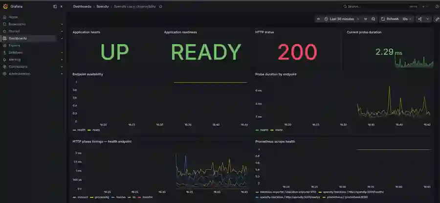
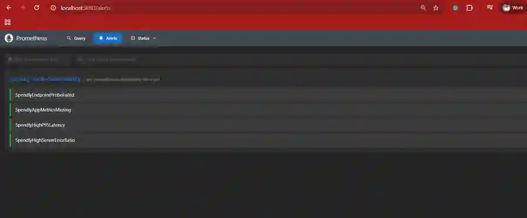
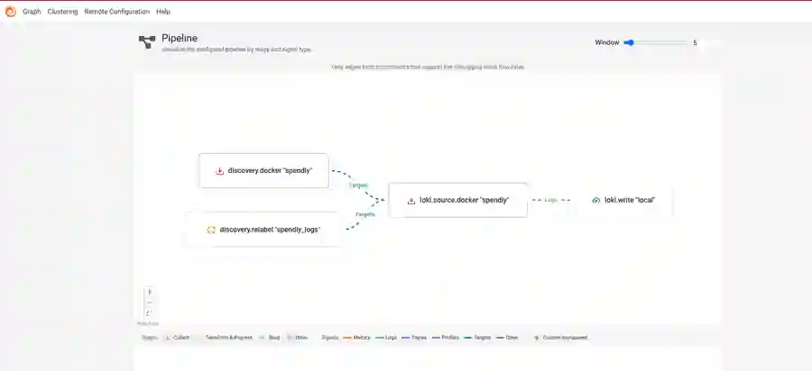
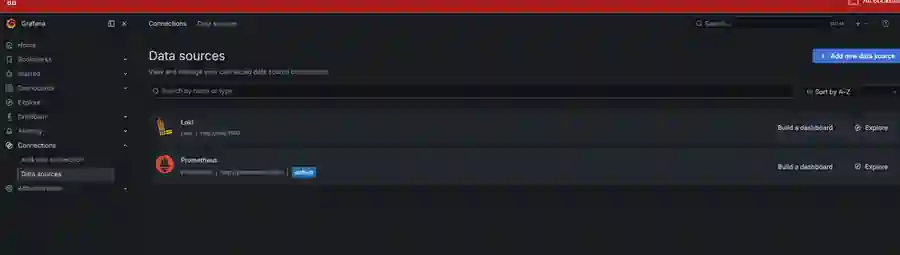
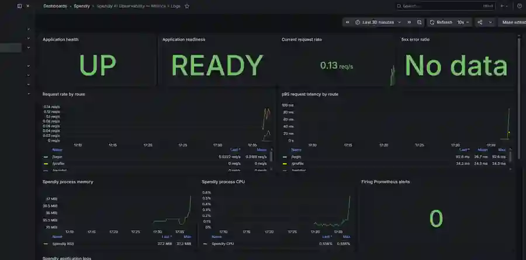
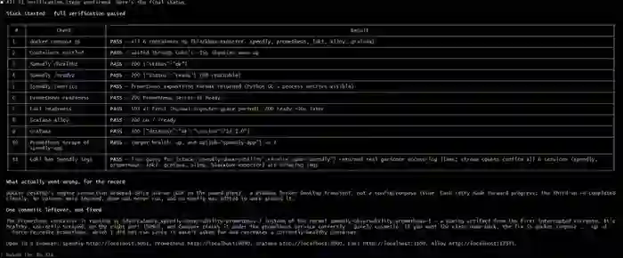
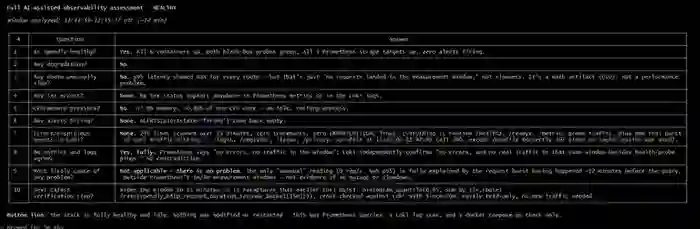
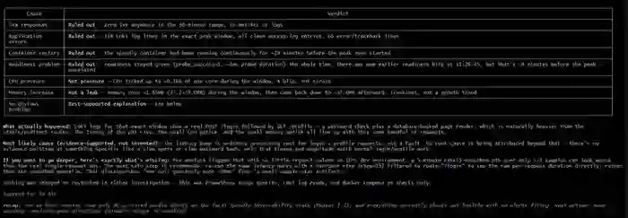

# Claude Code, Properly Wired: Spec-Driven Development, Deployment, and AI-Assisted Observability

> **Consolidated edition.** This document brings the Spendly Claude Code workflow into one readable guide: project context, slash commands, subagents, skills, hooks, MCP, plugins, deployment, and the later AI-assisted observability work using Prometheus, Grafana, Loki, Grafana Alloy, and Claude.

---

## Table of contents

1. [What we built](#1-what-we-built)
2. [CLAUDE.md: persistent project context](#2-claudemd-persistent-project-context)
3. [Slash commands](#3-slash-commands)
4. [Context-window engineering](#4-context-window-engineering)
5. [Spec-Driven Development](#5-spec-driven-development)
6. [Permission modes and reasoning effort](#6-permission-modes-and-reasoning-effort)
7. [Command → Agent → Skill](#7-command--agent--skill)
8. [Built-in subagents](#8-built-in-subagents)
9. [MCP servers](#9-mcp-servers)
10. [Hooks and guardrails](#10-hooks-and-guardrails)
11. [Plugins](#11-plugins)
12. [Watching agents with agents-observe](#12-watching-agents-with-agents-observe)
13. [Deployment: Docker and AWS EC2](#13-deployment-docker-and-aws-ec2)
14. [AI-Assisted Observability](#14-ai-assisted-observability)
15. [Final mental model](#15-final-mental-model)

---

## 1. What we built

The project used **Spendly**, a deliberately simple Flask + SQLite expense tracker, as the vehicle for learning how to wire Claude Code into a real engineering workflow.

The application itself was intentionally ordinary:

```text
spendly/
├── app.py
├── database/
│   ├── db.py
│   └── queries.py
├── templates/
├── static/
├── tests/
├── requirements.txt
├── requirements-prod.txt
├── Dockerfile
├── compose.yaml
└── deploy/
```

The more interesting deliverable was the Claude control plane:

```text
.claude/
├── agents/
├── commands/
├── hooks/
├── skills/
├── specs/
├── settings.json
└── verify_setup.py
```

The project taught one idea repeatedly:

> Claude Code becomes reliable when you stop treating it as a chatbot and start treating its instructions, agents, skills, hooks, and verification scripts as an engineering control plane.

The application is the **product plane**. The `.claude/` configuration is the **agent control plane**.

```text
Human intent
   ↓
CLAUDE.md
   ↓
Command
   ↓
Agent
   ↓
Skill
   ↓
Tools / repository
   ↓
Hooks / verification / CI
```

---

## 2. `CLAUDE.md`: persistent project context

There are two useful scopes.

| Scope | Typical path | Purpose |
|---|---|---|
| Global | `~/.claude/CLAUDE.md` | How you generally prefer to work |
| Project | `<repo>/CLAUDE.md` | Facts and constraints for this repository |

The global file should contain stable personal workflow preferences. The project file should contain repository-specific facts such as:

- architecture and important paths,
- coding conventions,
- route ownership,
- database rules,
- testing commands,
- known security limitations,
- deployment constraints,
- Claude agent/skill/command wiring.

The most important rule is:

> **Update project instructions in the same change that changes the code.**

In an ordinary repository, stale documentation is annoying. In an AI-assisted repository, stale instructions actively propagate into future agent decisions.

A useful heuristic is:

```text
high reuse + high consequence if wrong
    → keep in CLAUDE.md

large procedure needed only sometimes
    → put in a skill/reference

temporary state
    → keep in an issue/spec/task
```

---

## 3. Slash commands

A slash command is a Markdown workflow in `.claude/commands/`.

For example:

```markdown
---
description: Create a spec and branch for the next feature
argument-hint: "step number and feature name"
allowed-tools: Read, Write, Glob, Grep, Agent, Bash(git:*)
---

Validate prerequisites.
Delegate repository research.
Create the specification.
Create or switch to the feature branch.
Return the handoff.
```

The filename becomes the command.

```text
create-spec.md
    → /create-spec
```

A useful command answers five questions:

1. What triggers this workflow?
2. What inputs are required?
3. What preconditions must be true?
4. Which agent or tool acts, and in what order?
5. What counts as complete, blocked, or failed?

That makes slash commands much more than prompt shortcuts. They are **declarative workflow contracts**.

### Least privilege matters

A read-only review workflow should not receive generic write capability.

```text
Review command
   → Read
   → Grep
   → Glob
   → git diff/status

not
   → unrestricted Edit/Write
```

This reduces both security risk and accidental behavior.

---

## 4. Context-window engineering

The context window is an active information budget.

Always-on instructions compete with:

- source code,
- tool output,
- current specifications,
- conversation history,
- plugin/tool descriptions.

The project originally experimented with multiple sibling DevOps skills. That created unnecessary always-on routing descriptions.

The better design was **progressive disclosure**:

```text
Small routing description
    ↓
spendly-devops/SKILL.md
    ↓
phase-specific reference
```

For example:

```text
.claude/skills/spendly-devops/
├── SKILL.md
└── references/
    ├── phase-1-docker.md
    ├── phase-2-cloud-vm.md
    ├── phase-3-kubernetes.md
    └── cicd.md
```

Only the relevant detail loads when needed.

### Delegation is also context engineering

A built-in Explore agent can inspect many files and return a compact summary.

```text
Main session
   ↓
Explore subagent reads broadly
   ↓
returns only useful conclusions
```

The main session pays for the conclusion rather than every intermediate read.

---

## 5. Spec-Driven Development

The core development cycle was:

```text
Spec → Review → Design → Review → Tasks → Build → Validate
```

The most valuable part is not the sequence itself. It is the fact that the contract exists **before** implementation.

An agent can produce plausible code for a misunderstood request. A specification gives both the human and the model something explicit to validate against.

### Independent tests

The preferred pattern is:

```text
Specification
   ├──→ implementation
   └──→ independent tests
```

Tests should not merely mirror the implementation.

A Definition of Done gives traceability:

```text
DoD item
   ↓
test
   ↓
result
   ↓
review evidence
   ↓
PR evidence
```

### Why early human review has high leverage

Correcting a misunderstanding in a short spec is cheaper than correcting it after:

- implementation,
- tests,
- documentation,
- deployment artifacts,
- monitoring rules

have all been created from the wrong assumption.

---

## 6. Permission modes and reasoning effort

Permission mode and reasoning effort are different axes.

### Permission modes

| Mode | Meaning |
|---|---|
| default | Ask before sensitive actions |
| acceptEdits | File edits are smoother; commands may still ask |
| plan | Read-only planning |
| bypassPermissions | Minimal harness approval friction |

### Reasoning effort

Higher effort is useful for:

- architecture,
- ambiguous bugs,
- security analysis,
- adversarial review.

Lower effort is often sufficient for mechanical transformations.

A useful decision model is:

```text
risk
+ blast radius
+ reversibility
+ uncertainty
+ observability
    ↓
choose permission + reasoning level
```

External controls such as IAM, CI, branch protection, and deployment approvals should remain authoritative regardless of local Claude settings.

---

## 7. Command → Agent → Skill

This became the core architecture.

| Primitive | Responsibility |
|---|---|
| Command | Orchestration and sequencing |
| Agent | Role, isolated context, tool boundary |
| Skill | Reusable domain knowledge |

The short mental model is:

> A command decides **what happens in what order**.  
> An agent decides **who does it and with which tools**.  
> A skill supplies **what that agent needs to know**.

### Examples

```text
/test-feature
   ↓
spendly-test-writer
   ↓
spendly-test-runner
```

```text
/code-review-feature
   ├── security reviewer
   └── quality reviewer
```

```text
/deploy-phase
   ↓
spendly-devops-engineer
   ↓
spendly-devops skill
   ↓
phase-specific reference
   ↓
spendly-devops-reviewer
```

### Sequential vs parallel

Use sequential execution for data dependencies.

```text
writer → runner
```

Use parallel execution for independent viewpoints.

```text
security reviewer ─┐
                   ├→ combined result
quality reviewer ──┘
```

### Verify the wiring

Markdown references are soft dependencies. A command can keep naming an agent that was renamed yesterday.

That is why the project used a verification script.

```bash
python .claude/verify_setup.py
```

The reusable lesson is:

> If a configuration error would otherwise appear only when a rare workflow runs, move that failure into a cheap automated check.

---

## 8. Built-in subagents

Built-in subagents were useful for general repository work.

### Explore

Use for broad read-only repository discovery:

- locate routes,
- inspect architecture,
- find tests,
- understand existing patterns.

### Plan

Use for read-only implementation design:

- identify affected files,
- surface trade-offs,
- propose sequencing,
- detect prerequisites.

Subagents are useful when they reduce:

1. search pressure,
2. role pressure,
3. concurrency pressure.

They are less useful when explaining the task costs nearly as much as doing it.

---

## 9. MCP servers

MCP is useful when Claude needs a structured capability from another process or service.

The mental model is:

```text
Model
   ↓
Claude Code MCP client
   ↓
MCP server
   ↓
target system
```

The strongest reason to use MCP is often **capability reduction**.

Instead of:

```text
Bash
   → potentially anything the local user can execute
```

you can expose:

```text
query_readonly(sql)
   → SELECT only
   → row limit
   → validated structured output
```

### When MCP is valuable

- non-shell systems,
- shared team integrations,
- centrally managed credentials,
- typed structured outputs,
- narrower permissions than shell access.

### When MCP is unnecessary

If a constrained shell command already solves the task safely and simply, MCP may only add lifecycle and maintenance complexity.

---

## 10. Hooks and guardrails

Hooks place deterministic logic around probabilistic reasoning.

A skill can advise:

```text
Do not delete the database.
```

A hook can enforce:

```text
destructive command + protected path
    → block
```

### Useful hook categories

```text
UserPromptSubmit
   → routing / context injection

PreToolUse
   → blocking / policy

PostToolUse
   → formatting / validation
```

The project used hooks for:

- DevOps routing,
- Python formatting,
- destructive-path protection.

### Test hooks like production code

False positives can make a useful guardrail unusable.

Regression tests should include:

- expected blocks,
- safe near-misses,
- stdin/stdout contracts,
- exit codes,
- platform syntax,
- every historical false positive.

Hooks are helpful safety mechanisms, but mandatory organizational controls should still exist outside the local Claude configuration.

---

## 11. Plugins

A plugin can bundle:

- commands,
- agents,
- skills,
- hooks,
- MCP servers.

Treat plugins as software supply-chain dependencies.

Before enabling one, inspect:

1. capabilities,
2. automatic hook execution,
3. always-on context cost,
4. update ownership and trust.

A mature organization can use an approved internal marketplace and version-reviewed plugin set.

---

## 12. Watching agents with `agents-observe`

Terminal scrollback becomes difficult once commands spawn multiple agents.

`agents-observe` provided a browser view of the hierarchy.

It made several behaviors visible:

- test writer → test runner handoff,
- security and quality reviewers running in parallel,
- skill loading,
- gates and shipping,
- retries and partial failures.

The most important incident was a reviewer that appeared as:

```text
Done
0 tool uses
```

That was not a successful review.

The broader lesson is:

> Completion should be inferred from evidence, not only from a status label.

A better completion contract is:

```text
status completed
AND output exists
AND expected evidence exists
AND required tools were used where appropriate
AND no tool/API failure occurred
```

---

## 13. Deployment: Docker and AWS EC2

Deployment was divided into phases.

```text
Phase 0
   → make the application deployable

Phase 1
   → Docker / Compose

Phase 2
   → cloud VM

Phase 3
   → Kubernetes
```

### Phase 0: prerequisites

Before containerization or cloud deployment, the application needed deployment-safe behavior:

- externalized secret handling,
- persistent DB path,
- safe seed behavior,
- liveness/readiness endpoints.

A useful distinction is:

```text
/healthz
   → Is the process alive?

/readyz
   → Can this instance safely receive traffic?
```

A liveness probe should not restart a healthy process merely because a dependency is temporarily unavailable.

### Phase 1: Docker

Important ideas included:

- production WSGI server rather than Flask debug server,
- persistent `/data`,
- non-root execution,
- SQLite WAL,
- health checks,
- safe `.dockerignore`.

One serious finding was that a weak `.dockerignore` pattern could allow nested database files into the image context.

The general lesson:

> `.gitignore` does not protect Docker build context. Test what actually enters the image.

### Phase 2: AWS EC2

The VM path added:

- nginx,
- HTTPS,
- secure cookies,
- reverse-proxy awareness,
- SSM access instead of open SSH,
- persistent volume,
- backup storage,
- least-privilege IAM.

A critical networking principle was:

```text
Internet
   ↓
80/443
   ↓
nginx
   ↓
127.0.0.1:5001
   ↓
Spendly
```

The application port should not bypass the reverse proxy.

### SQLite backups

With WAL enabled, copying only the main database file can miss committed data still present in the WAL.

A consistent SQLite backup mechanism is preferable to blind `cp`.

### Kubernetes ceiling

SQLite remains a single-writer architectural constraint.

Kubernetes cannot turn a single-file database into a horizontally scalable multi-writer datastore merely by increasing replica count.

That decision belongs at architecture level, not in a manifest trick.

---

# 14. AI-Assisted Observability

After the development and deployment workflows were wired, the next question was:

> Can Claude help diagnose application behavior from real metrics and logs while keeping Prometheus, Grafana, Loki, and Alloy as the deterministic source of truth?

The answer was yes — if Claude is used as a **read-only correlation layer**, not as a replacement for observability infrastructure.

---

## 14.1 What we added

The repository gained a dedicated observability workflow.

```text
.claude/
├── commands/
│   └── observe-local.md
├── agents/
│   └── spendly-observability-analyst.md
└── skills/
    └── spendly-observability/
        └── SKILL.md
```

The architecture reused the same primitive separation developed earlier:

```text
/observe-local
   ↓
spendly-observability-analyst
   ↓
spendly-observability skill
```

The command owns orchestration.

The agent owns the isolated, read-only investigation role.

The skill owns the observability reasoning procedure.

---

## 14.2 Observability architecture

The resulting telemetry flow was:

```text
                     ┌──────────────────────┐
                     │      Spendly App     │
                     └──────────┬───────────┘
                                │
              ┌─────────────────┴─────────────────┐
              │                                   │
              ▼                                   ▼
       Application metrics                    App logs
              │                                   │
              ▼                                   ▼
         Prometheus                         Grafana Alloy
              │                                   │
              │                                   ▼
              │                                  Loki
              │                                   │
              └──────────────┬────────────────────┘
                             ▼
                           Grafana
                             │
                             │ human evidence
                             ▼

Claude Code
   ↓
/observe-local
   ↓
observability analyst
   ↓
read-only metric + log correlation
   ↓
evidence-based report
```

The most important principle is:

> Deterministic observability tools own the facts. Claude helps interpret relationships between those facts.

---

## 14.3 Phase 1: Grafana dashboard

The first step established a working metrics view.



A dashboard loading successfully was not enough. We wanted to verify that application metrics were actually flowing through the pipeline and could answer operational questions.

The dashboard gave us the first human-readable evidence surface.

---

## 14.4 Prometheus alert rules

The next step added deterministic alert conditions.



This established a clear division of responsibility.

Prometheus should evaluate things that can be expressed deterministically:

```text
error rate
latency threshold
availability
request-rate behavior
process-health conditions
```

Claude should not replace those rules.

Claude becomes useful **after** a signal exists and the operator needs to correlate several sources.

---

## 14.5 Application RED and process metrics

The application was instrumented so we could reason about the classic RED dimensions.

### Rate

How much traffic is arriving?

### Errors

How much traffic is failing?

### Duration

How long are requests taking?

Process metrics provided an additional runtime-health view.

This moved the system beyond:

```text
container is running
```

toward:

```text
application is behaving normally
```

Those are very different statements.

---

## 14.6 Logs with Grafana Alloy and Loki

Metrics tell us **that** something changed.

Logs often help explain **what happened**.

Grafana Alloy collected the application/runtime logs and forwarded them to Loki.



The log path was:

```text
Spendly logs
   ↓
Grafana Alloy
   ↓
Loki
   ↓
Grafana
```

A running Alloy process was not accepted as proof.

We needed to verify the whole path:

```text
log generated
   ↓
collector sees it
   ↓
labels are correct
   ↓
Loki receives it
   ↓
query returns it
```

That distinction matters in every telemetry system.

---

## 14.7 Grafana data sources

Grafana was configured to query both metrics and logs.



Verifying data sources explicitly is important because a dashboard may render partially while one backend is broken.

That can create misleading confidence.

---

## 14.8 Combined metrics and logs dashboard

The integrated Grafana view brought metrics and logs into the same operational workflow.



The useful mental model is:

```text
latency spike
   ↓ same time window
request/error behavior
   ↓ same time window
matching log events
```

For a human operator, Grafana is the evidence surface.

For Claude, the same sources become inputs to a structured correlation workflow.

---

## 14.9 Full-stack verification

The observability work was tested end to end.



The real question was not:

> Is Prometheus running?

or:

> Is Grafana running?

The question was:

> Can we move from application behavior to metrics, logs, dashboard evidence, and finally a Claude-assisted explanation without losing traceability?

That follows the same philosophy as the repository wiring verifier:

> Test the chain, not only the components.

---

## 14.10 `/observe-local`: the command

The observability slash command provides a repeatable entry point.

Conceptually, its responsibilities are:

```text
validate scope
   ↓
confirm read-only diagnosis
   ↓
delegate to observability analyst
   ↓
require observability skill
   ↓
collect report
   ↓
return evidence and uncertainty
```

This is better than repeatedly prompting:

```text
"Please check Grafana and tell me what is wrong."
```

because the command defines a stable diagnostic contract.

---

## 14.11 `spendly-observability-analyst`: the agent

A dedicated agent keeps diagnosis separate from remediation.

The analyst's job is to:

- inspect metrics,
- inspect logs,
- align time windows,
- correlate signals,
- explain likely causes,
- report confidence,
- state uncertainty,
- propose the next verification step.

It should **not**:

- change application code,
- restart containers,
- modify dashboards,
- edit Prometheus rules,
- alter Alloy/Loki configuration,
- mutate infrastructure.

This gives us a safer incident pattern:

```text
observe
   ↓
understand
   ↓
report
   ↓
human decision
   ↓
remediate through normal engineering workflow
```

---

## 14.12 `spendly-observability`: the skill

The skill contains reusable observability reasoning.

Instead of relying on generic troubleshooting, it pushes the analyst through questions such as:

```text
Did request rate change?
Did error rate change?
Did latency change?
Are process-health metrics abnormal?
Do logs show events in the same time window?
Does the timestamp alignment support the hypothesis?
What evidence contradicts the hypothesis?
How confident should we be?
```

This is important because LLMs are very good at producing plausible narratives.

The skill forces the report back toward evidence.

---

## 14.13 The prompt used for Claude correlation

A strong version of the final CLI request is:

```text
Use the Spendly observability workflow and analyze the current application behavior.

Check Prometheus metrics and Loki logs for the same time window.

Focus on:
- request rate,
- errors,
- latency,
- process health,
- matching log events.

Do not change code, containers, dashboards, alert rules, or infrastructure.

Return:
1. what changed,
2. metric evidence,
3. log evidence,
4. correlation between them,
5. the most likely explanation,
6. confidence and uncertainty,
7. the next verification step before remediation.
```

The wording deliberately separates **diagnosis** from **action**.

---

## 14.14 Claude's full correlation report

Claude returned a structured evidence narrative rather than a generic answer.



The report pattern is the important result:

```text
signal
   ↓
metric evidence
   ↓
log evidence
   ↓
time correlation
   ↓
likely explanation
   ↓
confidence
   ↓
next verification step
```

That becomes a reusable incident-analysis contract.

---

## 14.15 Latency correlation

A latency-focused analysis was also tested.



The useful behavior was not merely:

```text
latency is high
```

The useful behavior was:

```text
latency changed
   ↓
compare errors
   ↓
compare process health
   ↓
inspect logs
   ↓
check time correlation
   ↓
state what the evidence supports
```

This prevents correlation from becoming storytelling.

---

## 14.16 What we learned from Prometheus

Prometheus should remain responsible for deterministic monitoring.

If a condition can be defined mathematically, use a rule.

Examples:

```text
5xx rate > threshold
latency > threshold
process unavailable
request rate deviates
```

Do not ask an LLM every minute whether a metric is "bad."

That is expensive, inconsistent, and unnecessary.

---

## 14.17 What we learned from Alloy

A collector being healthy does not prove telemetry is flowing.

The pipeline must be verified end to end.

```text
source
   ↓
discovery
   ↓
processing
   ↓
labels
   ↓
forwarding
   ↓
Loki
   ↓
query
```

This principle applies equally to OpenTelemetry collectors, Fluent Bit, Logstash, Vector, or other telemetry pipelines.

---

## 14.18 What we learned from Grafana

Grafana remains important even when Claude can query telemetry.

Why?

Because the human needs an independent evidence surface.

The AI report should be auditable against:

- graphs,
- queries,
- log lines,
- timestamps,
- alert state.

A good AI-assisted workflow makes verification easier rather than hiding the underlying telemetry.

---

## 14.19 What Claude adds

Claude is useful for:

- synthesizing several signals,
- explaining relationships,
- prioritizing evidence,
- translating telemetry into an incident narrative,
- proposing the next verification step.

For example:

```text
Prometheus:
  duration increased

Prometheus:
  error rate stayed low

Loki:
  repeated slow-operation events appeared

Process metrics:
  runtime remained healthy

Claude:
  explains the combined pattern and proposes the next check
```

Claude does **not** own the facts.

---

## 14.20 What Claude should not replace

Claude is not:

- the alerting engine,
- the metric database,
- the log store,
- the dashboard,
- the source of truth,
- the final root-cause authority.

This matters because AI-assisted observability becomes unsafe when model-generated interpretation is presented as raw evidence.

---

## 14.21 Time alignment is essential

Correlation only makes sense when signals refer to the same period.

Bad correlation:

```text
metric spike at 14:05
+
unrelated log error at 09:10
=
invented incident story
```

Good correlation:

```text
metric spike at 14:05
+
matching logs around 14:05
+
supporting process/request signals
=
evidence-backed hypothesis
```

Always align the time window before asking Claude to interpret relationships.

---

## 14.22 Confidence and uncertainty are part of the output contract

An observability report should not simply say:

```text
Root cause: database contention.
```

A stronger report says:

```text
Most likely explanation: database contention.

Evidence:
- request duration increased,
- matching DB-related log events occurred in the same window,
- process health remained stable.

Confidence: medium.

Uncertainty:
- no distributed trace confirms which operation dominated request time.

Next verification:
- inspect the slowest DB path / add tracing for the affected operation.
```

That is much more operationally useful.

---

## 14.23 AI-assisted observability is correlation, not instrumentation

The deepest lesson is:

> AI sits **after** telemetry collection, not instead of it.

The dependency chain is:

```text
instrumentation
   ↓
collection
   ↓
storage
   ↓
queryability
   ↓
visualization / alerting
   ↓
AI correlation
```

If instrumentation is missing, Claude cannot recover the evidence.

If logs are not collected, Claude cannot infer their content.

If timestamps are wrong, Claude cannot repair the chronology reliably.

Observability quality must exist before AI can improve interpretation.

---

## 14.24 Why the same Claude architecture worked again

The observability feature did not require a new philosophy.

It reused the same primitives:

```text
Command
   → orchestration

Agent
   → isolated role + read-only boundary

Skill
   → domain procedure
```

That is a sign of good system design.

When a control plane is well structured, new capabilities are added through composition rather than through larger and larger prompts.

---

## 14.25 Recommended incident workflow

A mature workflow looks like this:

```text
1. Prometheus detects a deterministic signal.

2. Operator selects the incident time window.

3. /observe-local starts the read-only analysis.

4. Claude correlates Prometheus metrics and Loki logs.

5. Claude reports:
   - evidence,
   - hypothesis,
   - confidence,
   - uncertainty,
   - next verification step.

6. Human validates the hypothesis.

7. Remediation happens through the normal code/DevOps workflow.

8. Monitoring confirms recovery.
```

Diagnosis and remediation remain separate control points.

---

## 14.26 Observability as another control plane

The final architecture can be viewed as two cooperating systems.

```text
Engineering control plane
   ├── CLAUDE.md
   ├── commands
   ├── agents
   ├── skills
   ├── hooks
   ├── tests
   └── deployment workflow

Observability control plane
   ├── application metrics
   ├── Prometheus
   ├── alert rules
   ├── Grafana Alloy
   ├── Loki
   ├── Grafana
   └── Claude read-only correlation
```

The observability plane watches the application without automatically mutating it.

That separation protects evidence during incidents.

---

# 15. Final mental model

The complete project can now be summarized as one system.

```text
                       HUMAN INTENT
                            │
                            ▼
                      CLAUDE.md
                            │
             ┌──────────────┴──────────────┐
             ▼                             ▼
         COMMAND                       DIRECT TASK
             │
             ▼
           AGENT
             │
             ▼
           SKILL
             │
             ▼
     REFERENCES / TOOLS
             │
             ▼
     CODE / INFRASTRUCTURE
             │
       HOOKS + TESTS + CI
             │
             ▼
      APPLICATION RUNTIME
             │
       ┌─────┴─────────────┐
       ▼                   ▼
  PROMETHEUS           GRAFANA ALLOY
       │                   │
       │                   ▼
       │                  LOKI
       │                   │
       └────────┬──────────┘
                ▼
              GRAFANA
                │
                ▼
     CLAUDE READ-ONLY ANALYST
                │
                ▼
        EVIDENCE + HYPOTHESIS
                │
                ▼
           HUMAN DECISION
```

The design goal is not maximum autonomy.

The design goal is:

> **predictable automation, bounded authority, deterministic evidence, observable failures, and cheap verification that the wiring still matches reality.**

---

## Screenshot references used in this chapter

These paths already exist in the repository:

```text
docs/images/observability/01-phase1-grafana-dashboard.webp
docs/images/observability/02-prometheus-alert-rules.webp
docs/images/observability/03-alloy-pipeline.webp
docs/images/observability/04-grafana-datasources.webp
docs/images/observability/05-grafana-metrics-logs-dashboard.webp
docs/images/observability/07-full-stack-verification.webp
docs/images/observability/11-claude-full-correlation-report.webp
docs/images/observability/12-claude-latency-correlation-report.webp
```

---

*Consolidated from the Spendly Claude Code engineering journey: Spec-Driven Development, agent/skill/command wiring, deterministic guardrails, deployment, and AI-assisted observability.*
