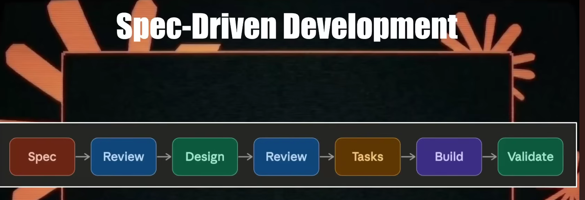
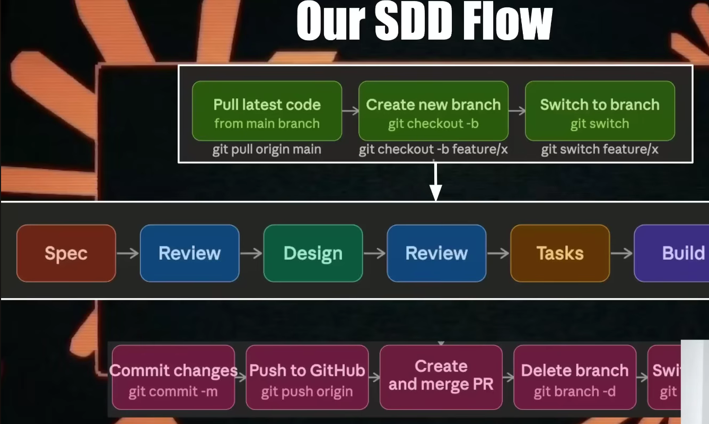
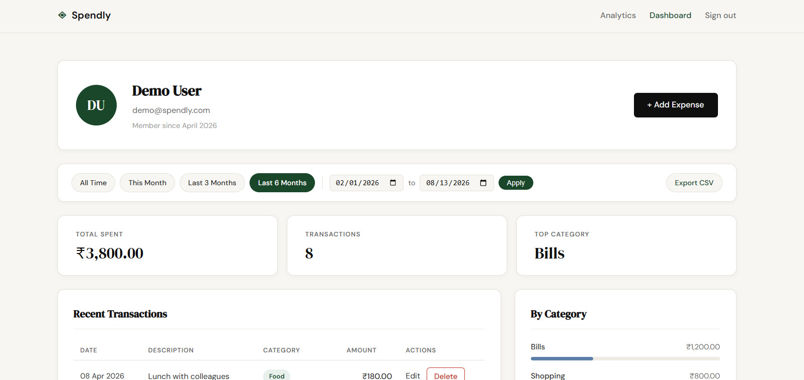
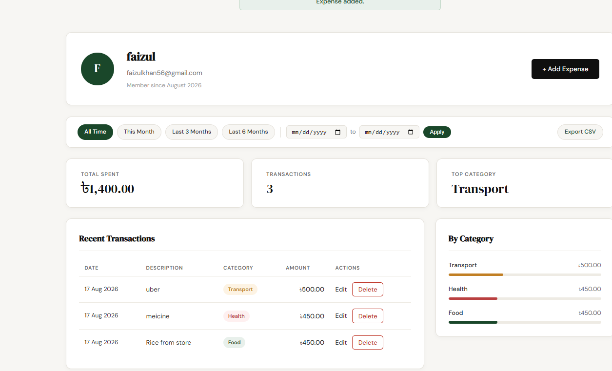
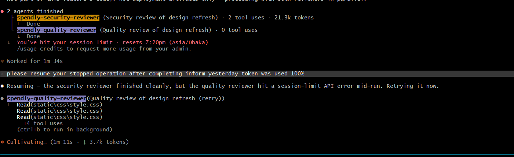
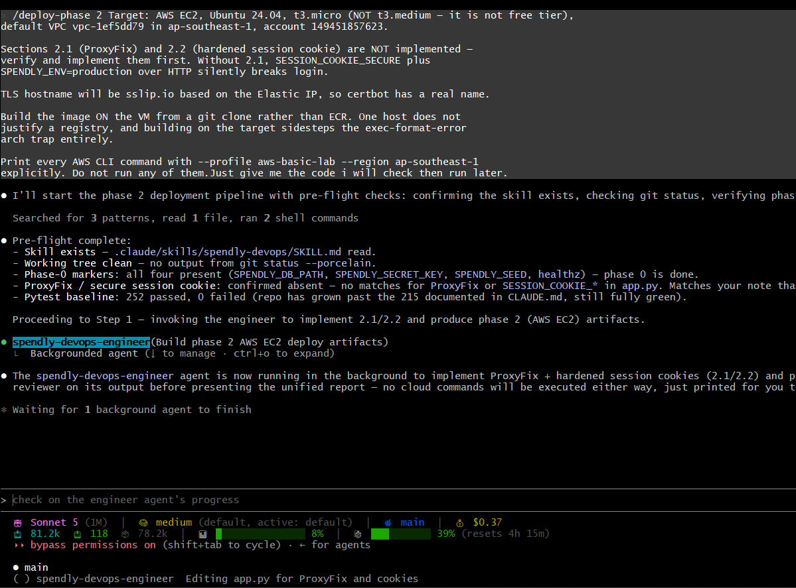

# Claude Code, Properly Wired: A One-Stop Guide to Spec-Driven Development on a Real Project

*Everything in this guide was executed on one repository — a Flask + SQLite expense
tracker called **Spendly** — from empty `.claude/` directory to a live app on AWS EC2
behind HTTPS. Every number, screenshot, and command is from that run. Nothing is
illustrative.*

---

## Table of contents

1. [What we built, and the project structure](#1-what-we-built-and-the-project-structure)
2. [`CLAUDE.md`: home vs project, and how to write one that earns its tokens](#2-claudemd-home-vs-project)
3. [Slash commands: the basics](#3-slash-commands-the-basics)
4. [The context window: what it costs and how to manage it](#4-the-context-window)
5. [Spec-Driven Development: the cycle, walked three times](#5-spec-driven-development)
6. [Modes: plan, accept-edits, YOLO, and effort tiers](#6-modes)
7. [Building the chain: command → agent → skill](#7-building-the-chain)
8. [Built-in subagents](#8-built-in-subagents)
9. [MCP servers: theory, diagram, and a Python implementation](#9-mcp-servers)
10. [Hooks and guardrails](#10-hooks-and-guardrails)
11. [Plugins](#11-plugins)
12. [`agents-observe`: watching agents work in a browser](#12-agents-observe)
13. [Deploying with the agent/skill/command chain: Docker and AWS EC2](#13-deploying-to-docker-and-aws)
- [Appendix A: final metrics](#appendix-a-final-metrics)
- [Appendix B: eleven things that went wrong](#appendix-b-eleven-things-that-went-wrong)

---

## The one-paragraph version

Claude Code becomes reliable when you stop prompting it and start **wiring** it. A
slash command orchestrates subagents; subagents load skills for domain knowledge;
hooks enforce invariants deterministically outside the model's judgment; and a
`CLAUDE.md` holds the facts every session needs. The discipline that makes this work
is **Spec-Driven Development** — write the contract first, review it, then build
against it, because a spec is the only artifact that both you and the model can hold
each other to. On Spendly this produced 14 merged PRs, 252 tests, 56 automated wiring
checks, and a deployed app — with a real security finding caught before merge.

---

## 1. What we built, and the project structure

**Spendly** is deliberately boring: a personal expense tracker, Flask, SQLite,
Jinja2 templates, vanilla JS, no build step. The app is the *vehicle*. The
`.claude/` directory is the *deliverable*.

That inversion matters. In a normal project, stale documentation is annoying. Here,
`CLAUDE.md` is read as ground truth by six subagents, so a stale fact is a *defect
that propagates*. More on this in [Appendix B](#appendix-b-eleven-things-that-went-wrong)
— it is the single most recurring bug class in the whole project.

### The application

```
spendly/
├── app.py                    # every route, single file, no blueprints
├── database/
│   ├── db.py                 # connection + schema + users
│   └── queries.py            # expense + profile reads/writes
├── templates/                # base.html + one file per page
├── static/css/               # style.css global; one file per page otherwise
├── tests/                    # pytest — 252 tests
├── requirements.txt          # dev + test
├── requirements-prod.txt     # -r requirements.txt + gunicorn
├── Dockerfile                # phase 1
├── .dockerignore
├── compose.yaml
└── deploy/vm/                # phase 2 — nginx, systemd, bootstrap, RUNBOOK
```

### The Claude Code setup

```
.claude/
├── CLAUDE.md  (project root, actually)   # always-on project facts
├── agents/          6 subagents
│   ├── spendly-test-writer.md            spec → tests
│   ├── spendly-test-runner.md            run + diagnose
│   ├── spendly-security-reviewer.md      auth, injection, exposure
│   ├── spendly-quality-reviewer.md       naming, placement, idiom
│   ├── spendly-devops-engineer.md        builds deploy artifacts
│   └── spendly-devops-reviewer.md        audits them, read-only
├── commands/        7 slash commands
│   ├── create-spec.md            spec + branch
│   ├── test-feature.md           writer → runner
│   ├── code-review-feature.md    security ∥ quality
│   ├── deploy-phase.md           engineer → reviewer
│   ├── ship-feature.md           commit → PR → merge → cleanup
│   ├── seed-user.md
│   └── seed-expense.md
├── skills/          2 skills
│   ├── spendly-devops/
│   │   ├── SKILL.md              router + phase 0 + invariants
│   │   └── references/           phase-1-docker, phase-2-cloud-vm,
│   │                             phase-3-kubernetes, cicd
│   └── spendly-ui-designer/SKILL.md
├── hooks/           3 Python hooks
│   ├── devops_router.py          UserPromptSubmit
│   ├── format_python.py          PostToolUse
│   └── protect_paths.py          PreToolUse — blocking
├── specs/           12 specs, one per feature step
├── settings.json                 hooks + permission allowlist (shared)
├── settings.local.json           personal overrides (untracked)
└── verify_setup.py               56 checks that the wiring is intact
```

**The load-bearing idea:** none of these components know about each other by magic.
Every reference is a string in a file, and strings rot. That is why
`verify_setup.py` exists — see [§7](#7-building-the-chain).

---

## 2. `CLAUDE.md`: home vs project

There are two, and they do different jobs.

| | Home / global | Project |
|---|---|---|
| Path | `~/.claude/CLAUDE.md` | `<repo>/CLAUDE.md` |
| Scope | every project you open | this repository |
| Tracked in git | no | **yes** — teammates inherit it |
| Contains | *how you like to work* | *facts about this codebase* |

### The home one is about you

Ours is short — a working-style preamble:

```markdown
# Faizul User Workflow

Default working style:
- Prefer actionable engineering outputs
- Use markdown tables when comparing
- For architecture: include tradeoffs
- For troubleshooting: root cause -> fix -> validation

When coding:
- prefer production-grade patterns
- secure defaults
- readable structure
- explain changed files

When uncertain:
- say assumptions clearly
- suggest verification
```

That is the right content for a global file: **preferences, not facts.** It applies
whether you are in a Flask repo or a Terraform one.

### The project one is about the code

Ours is 402 lines and ~5,100 tokens, loaded into **every** session. It carries:

| Section | Why it is there |
|---|---|
| Architecture tree | so nobody has to `ls -R` to orient |
| Code style | PEP 8, `url_for()` always, parameterised SQL always |
| Tech constraints | Flask only, SQLite only, vanilla JS, no new pip packages |
| Subagent Policy | when to delegate, and the DevOps auto-routing rule |
| Claude Code setup | the wiring map — command → agents → skill |
| Route table | all 12 routes with methods and access level |
| Testing | the 252 baseline and the DB-isolation pattern |
| Warnings | the sharp edges: no CSRF, no migrations, `debug=True` |

### Five principles that actually held up

**1. Write facts, not aspirations.** "All nine roadmap steps are implemented, there
are no stub routes left" is a fact. "We should add CSRF" is an aspiration, and it
belongs in an issue.

**2. State the *why*, briefly.** Compare:

> ❌ Never put DB logic in routes.
> ✅ Never put DB logic in routes — it belongs in `database/db.py` (connection,
> schema, users) or `database/queries.py` (anything touching `expenses`).

The second version tells an agent *which* file, which is the part it actually needs.

**3. Document the traps, not just the rules.** The highest-value lines in our
`CLAUDE.md` are the warnings:

```markdown
- **`app.secret_key` is hardcoded** and `debug=True` is hardcoded in `__main__`.
  Fine for local dev, unsafe anywhere else.
- **`seed_db()` runs at import time** and creates demo@spendly.com / demo123.
  Harmless locally; a working backdoor on any public host.
- **There is no CSRF protection.** Known gap — raise it, don't silently add a
  dependency for it.
- **There is no migration system.** A schema change means hand-editing a live
  SQLite file — back it up with VACUUM INTO, never cp.
```

Each of those saved an agent from a confident wrong move.

**4. Every rule needs an escape hatch, stated.** We say "no new pip packages" — and
then:

```markdown
**The one sanctioned exception — approved and landed.** Deployment needs a WSGI
server, because app.run(debug=True) exposes the Werkzeug debugger (remote code
execution). gunicorn==23.0.0 therefore lives in requirements-prod.txt.
```

Without that, an agent facing phase 1 has to either break a rule or fail. With it,
the decision is already made.

**5. Sync it in the same change, always.** If a PR adds a route, it updates the route
table. Not "later". We enforce this mechanically — `verify_setup.py` compares
`CLAUDE.md`'s route table against `app.py` **in both directions**, so a route in the
code but missing from the docs fails the check, and vice versa.

---

## 3. Slash commands: the basics

A slash command is a **markdown file** in `.claude/commands/`. The filename becomes
the command. `create-spec.md` → `/create-spec`.

Frontmatter configures it:

```markdown
---
description: Create a spec file and feature branch for the next Spendly step
argument-hint: "Step number and feature name e.g. 2 registration"
allowed-tools: Read, Write, Glob, Grep, Agent, Bash(git:*)
---

You are a senior developer spinning up a new feature...
User input: $ARGUMENTS
```

| Field | Purpose |
|---|---|
| `description` | shown in the `/` menu — this is also the *routing signal* |
| `argument-hint` | inline hint for expected args |
| `allowed-tools` | least privilege. `Bash(git:*)` allows git, nothing else |
| `$ARGUMENTS` | substituted with whatever follows the command |

**The body is a prompt, not a script.** It is instructions to the model, so it can
contain conditionals, gates, and refusals in plain English:

```markdown
If no argument is provided, stop immediately and say:
"Please provide a phase. Usage: /deploy-phase <0|1|2|3|cicd>"
```

**`allowed-tools` is the security boundary.** `/code-review-feature` is scoped to
`Bash(git diff), Bash(git status), Read, Glob` — it structurally *cannot* edit a
file, no matter what the diff tempts it to do.

---

## 4. The context window

Every session starts with a fixed budget. Understanding what consumes it before you
type anything is the difference between a setup that scales and one that chokes.

### What loads automatically, and what does not

| Layer | Auto-loaded? | Cost |
|---|---|---|
| Project `CLAUDE.md` | **yes, every session** | ours: ~5,100 tokens |
| Home `CLAUDE.md` | **yes** | ours: ~150 tokens |
| Hooks | yes, but they run *outside* the model | **0 context** |
| Agent / skill **descriptions** | yes — needed for routing | 1 line each |
| Agent / skill / command **bodies** | **no** — only when invoked | 0 until used |
| `references/*.md` | **no** — only when `Read` | 0 until used |
| Memory (`MEMORY.md`) | yes | ~3 lines |

That table is the whole game. **Descriptions are always-on; bodies are on-demand.**

### The mistake we made, and the fix

We first wrote **five sibling skills** — `spendly-devops`, `spendly-docker`,
`spendly-cloud-vm`, `spendly-kubernetes`, `spendly-cicd`. Measured cost:

```
spendly-cicd          desc = 711 chars
spendly-cloud-vm      desc = 770
spendly-devops        desc = 759
spendly-docker        desc = 664
spendly-kubernetes    desc = 827
-------------------------------------
TOTAL   3,731 chars ≈ 932 tokens, in EVERY session
```

Nearly a thousand tokens spent in sessions that never touch deployment. Worse, the
descriptions were long *because they had to disambiguate from each other* —
`spendly-kubernetes` needed 827 characters listing "PVC, StorageClass,
CrashLoopBackOff, HPA" purely so it would not collide with `spendly-docker`.

The tell that it was wrong: **every one of those skills opened with "load
`spendly-devops` first."** A skill that is not usable until you load a sibling is a
*chapter*, not a skill.

**The fix — progressive disclosure.** One skill, four reference files:

```
.claude/skills/spendly-devops/
├── SKILL.md                        # router + phase 0 + invariants (281 lines)
└── references/
    ├── phase-1-docker.md           # 273 lines, loaded only for phase 1
    ├── phase-2-cloud-vm.md         # 393
    ├── phase-3-kubernetes.md       # 430
    └── cicd.md                     # 311
```

```
Always-on cost:  932 tokens  →  146 tokens      (-786)
On-demand body:  unchanged — 1,407 lines still available when needed
```

The router's description no longer disambiguates anything; it only has to recognise
"this is infrastructure-shaped."

### Practical levers

- **`/context`** — inspect what is consuming the window right now.
- **`claude plugin details <name>`** — a plugin's projected token cost *before* you
  commit to it. Ours reported `Always-on: ~27 tok` for `agents-observe`, which turned
  a vague worry into a non-issue.
- **Put detail in `references/`, keep `SKILL.md` a router.**
- **Prefer one skill with references over many sibling skills.**
- **Auto-compaction** handles long conversations, but do not rely on it — a 5,000
  token `CLAUDE.md` is paid on every turn regardless.

> **Watch item:** our `CLAUDE.md` grew from ~150 lines to 402 (~5,100 tokens) over the
> project. That is the next thing worth trimming — probably by moving the "Adding a
> new feature" walkthrough into a skill.

---

## 5. Spec-Driven Development

### The theory



```
Spec → Review → Design → Review → Tasks → Build → Validate
```

The two `Review` gates are the point. Anyone can get a model to write code; the
difficulty is knowing whether the code is *the right code*. A spec makes that
answerable, because it converts "does this look good?" into "does this satisfy the
Definition of Done?"

**Why this matters more with an agent than with a human.** A human developer who
misunderstands a requirement usually produces something visibly odd. An agent that
misunderstands produces something *confidently plausible* — correct-looking code
solving the wrong problem. The spec is the artifact that makes that detectable,
because tests get written from the spec, not from the implementation.

That last clause is the mechanism. Our `spendly-test-writer` agent is explicitly
forbidden from reading the implementation for test logic:

```markdown
## Core Principle
You write tests based on **feature specifications and expected behavior**, never by
reading or reverse-engineering the implementation. Your tests define what the
feature *should* do, serving as a correctness contract.
```

If tests are derived from the code, they assert that the code does what it does —
which is always true and tells you nothing.

### Our flow, with git wrapped around it



```
git pull origin main  →  git checkout -b feature/x  →  git switch feature/x
                                    ↓
       Spec → Review → Design → Review → Tasks → Build → Validate
                                    ↓
git commit -m  →  git push origin  →  create+merge PR  →  git branch -d  →  switch
```

Each stage maps to a command:

| SDD stage | Our command | Actor |
|---|---|---|
| Spec | `/create-spec 10 export expenses csv` | `Explore` subagent researches |
| Review | *human reads the spec* | you |
| Design | Plan mode, Shift+Tab ×2 | `Plan` subagent |
| Review | *human approves the plan* | you |
| Tasks + Build | plain prompting | main agent |
| Validate | `/test-feature`, `/code-review-feature` | 4 subagents |
| Ship | `/ship-feature` | main agent + GitHub |

### Walkthrough 1: Step 10, CSV export (the reference run)

This is the one we captured end to end.

**Spec.** `/create-spec 10 export expenses csv` checked the tree was clean, branched
to `feature/export-expenses-csv`, delegated research to the `Explore` subagent, and
wrote `.claude/specs/10-export-expenses-csv.md` with a fixed shape: Overview,
Depends on, Routes, Database changes, Templates, Files to change, Files to create,
New dependencies, Rules for implementation, **Definition of done**.

**Build.** The implementation subagent read the spec, then `CLAUDE.md`,
`queries.py`, `app.py`, `profile.html`, `profile.css` — and then grepped
`style.css` for `--token:` declarations:


That grep is the `spendly-ui-designer` skill's rule *"use the tokens, never hardcode
a hex"* being obeyed without anyone restating it. This is what a correctly wired
setup looks like from the outside.

The interesting technical decision was a trap the spec caught. The obvious move is to
reuse `get_recent_transactions()`. But it formats for *display* — `"1,200.00"` and
`"03 Apr 2026"` — and carries `limit=10`. A CSV needs `1200.0`, `2026-04-03`, and no
limit. So a new helper, `get_expenses_for_export()`, was correct.

**Test.** `/test-feature 10-export-expenses-csv` ran writer → runner, sequentially:


25 test functions, 29 cases, each traceable to a Definition-of-Done item:


**Review.** `/code-review-feature 10-export-expenses-csv` forked both reviewers in
**parallel**:


Visible in the dashboard as two `Agent` spawns from one `Main`:


**The finding that justified the whole pipeline:** security cleared the auth guard,
SQL-level `user_id` scoping, and the parameterised date filter — then flagged
**CSV formula injection** via free-text `description` and `category`. A cell
beginning `=`, `+`, `-`, or `@` executes as a formula when the file opens in Excel.
Fixed in the same PR with a `_csv_safe()` helper. Severity: Medium. Caught
pre-merge.

**Ship.** `/ship-feature` → PR #3, squash-merged, both branches deleted:


With the audit trail written into the PR body:


**Result:** feature live, 186 → 215 tests.



### Walkthrough 2: Steps 11 and 12, localization then redesign

The request arrived as one sentence: *"change the currency from Rs to BDT, change the
default name, make it feel Bangladeshi, and change the design."*

**That is two features, and splitting them was the highest-value decision.**

| | Scope | Risk |
|---|---|---|
| Step 11 — localization | 8 files, find-and-replace + seed data + 4 test assertions | low |
| Step 12 — design refresh | 1,592 lines of CSS + every template | high |

Mixed into one PR you cannot tell a broken layout from a broken currency render, and
if the design is wrong you lose the localization on rollback.

**Step 11** — every `₹` → `৳`, placeholders to `Faizul Rahman` /
`faizul@example.com`, and seed data rewritten to Bangladeshi context:
`Groceries from Meena Bazar`, `CNG fare to office`, `DESCO electricity bill`.

Two decisions were settled *in the spec*, before any code:

- **Number grouping stays Western** `"{:,.2f}"`. South Asian convention is
  `1,40,000`, but changing it touches `get_expenses_for_export()` and the CSV tests
  assert comma-free raw amounts. Bigger than it looks.
- **`demo@spendly.com` / `demo123` stays.** It is cited in `CLAUDE.md` and in every
  PR's "How to test". Rename the display name, not the login.



**Step 12** — `--accent: #1a472a → #006A4E` (Bangladesh bottle green),
`--accent-2: #c17f24 → #F42A41` (flag red), new `favicon.svg`, +37 tests.

The critical instruction: **update `spendly-ui-designer/SKILL.md` in the same
change.** It hardcodes the palette, and the quality reviewer reads it as ground truth
— leave it stale and the reviewer flags your *correct* new code as a violation. You
can watch it happen:


### Walkthrough 3: Phase 0, making the app deployable

Not a feature: a **prerequisite**. The app as written could not run outside a dev
checkout, for four independent reasons.

| # | Problem | Consequence |
|---|---|---|
| 0.1 | `DB_PATH` pinned to repo root | in a container that is `/app/spendly.db` — inside the image layer, so every restart wipes data and no volume can hold it |
| 0.2 | `app.secret_key = "dev-secret-key"` | a known signing key means anyone forges a session cookie and logs in as any user |
| 0.3 | `seed_db()` at import time | creates `demo@spendly.com` / `demo123` — a working backdoor on a public host |
| 0.4 | no health endpoint | nothing a load balancer, `HEALTHCHECK`, or k8s probe can call |

Run via `/deploy-phase 0`. Its pre-flight:


Then engineer → reviewer:


**A design detail worth stealing:** `/healthz` and `/readyz` are deliberately
different.

```python
@app.route("/healthz")
def healthz():
    """Liveness — the process is up. Deliberately does NOT touch the DB."""
    return {"status": "ok"}, 200


@app.route("/readyz")
def readyz():
    """Readiness — the DB is reachable and writable."""
    if not db_is_healthy():
        abort(503)
    return {"status": "ready"}, 200
```

A liveness probe that touches the database turns a *locked* database into a *restart
loop*, which makes the lock worse. Liveness asks "is the process wedged"; readiness
asks "should traffic come here". Conflating them is a classic self-inflicted outage.

**A repo-specific trap this surfaced:** `verify_setup.py` hardcodes the route list
**twice** — forward ("claimed routes exist in `app.py`") and reverse ("no
undocumented routes"). Adding two routes fails *both* until `CLAUDE.md`'s table and
both literals are updated. The duplication is intentional; a comment now says so, so
nobody "fixes" the failure by deleting a list.


And its non-blocking follow-up, honestly recorded rather than quietly dropped:


---

## 6. Modes

### Permission modes

Four, cycled with **Shift+Tab**:

| Mode | Behaviour | When |
|---|---|---|
| **default** | asks before edits and commands | unfamiliar repo; anything destructive |
| **acceptEdits** | file edits auto-approved; Bash still asks | steady implementation |
| **plan** | **read-only** — cannot edit, only produce a plan | before any non-trivial change |
| **bypassPermissions** ("YOLO") | nothing asks | sandboxes, throwaway branches, long grinds |

Set a default in `settings.json`:

```json
{ "permissions": { "defaultMode": "acceptEdits" } }
```

Or launch straight into bypass:

```bash
claude --dangerously-skip-permissions
claude -c --dangerously-skip-permissions      # -c resumes the current conversation
```

If `~/.claude/settings.json` has `"skipDangerousModePermissionPrompt": true`, the
startup warning is pre-dismissed.

### Plan mode is the SDD "Design" gate

This is the most under-used mode. In plan mode the model **cannot write**, which
changes its behaviour: it reads more, and it surfaces disagreements *before* they
are baked into a diff. Our `CLAUDE.md` makes it mandatory:

```markdown
- always use a builtin plan subagent in plan mode
- When asked to plan, delegate codebase research to a subagent before presenting
```

Enter with **Shift+Tab twice**. Exit by approving the plan.

### Effort tiers, and what "ultra" means

Separate from permissions, Claude Code has **reasoning effort**: `low`, `medium`,
`high`, `xhigh`, `max`. The status line shows the active tier:

```
Sonnet 5 (1M) | medium (default, active: default) | main | $0.37
81.2k tokens | 8% | 39% (resets 4h 15m)
bypass permissions on (shift+tab to cycle)
```

Escalate for hard reasoning — an ambiguous bug, an architectural trade-off, an
adversarial review. Drop to `low` for mechanical work. Most of Spendly ran on
`medium`.

There is also a genuinely separate feature:

```bash
claude ultrareview            # cloud-hosted multi-agent review of the current branch
```

That runs a *fleet* rather than a single reviewer, which is a different tool from
raising effort on one agent.

### The two layers people conflate

`--dangerously-skip-permissions` silences the **harness**. It does not silence the
**model's judgment** — Claude will still pause before hard-to-reverse or
outward-facing actions. In this project, even in bypass mode, it stopped to ask
before untracking database files containing real password hashes.

To collapse that second layer you must say so in words: *"commit and push without
asking"*, *"merge PRs yourself"*. Two layers, two mechanisms.

### Recommended pairing

| Situation | Permissions | Effort |
|---|---|---|
| Exploring an unknown repo | plan | high |
| Designing a feature | plan | high / xhigh |
| Implementing an approved spec | acceptEdits | medium |
| Mechanical refactor, renames | acceptEdits | low |
| Long autonomous grind in a sandbox | bypass | medium |
| Adversarial review of a security fix | default | xhigh / max |

---

## 7. Building the chain

### Anatomy of the three primitives

| | File | Job | Loads |
|---|---|---|---|
| **Command** | `.claude/commands/x.md` | *orchestration* — sequence, gates, reporting | on invoke |
| **Agent** | `.claude/agents/x.md` | *isolation* — own context, own tool allowlist | on spawn |
| **Skill** | `.claude/skills/x/SKILL.md` | *knowledge* — domain facts, traps, checklists | on invoke |

The distinction that took us longest to internalise:

> **A command decides *what happens in what order*. An agent decides *who does it,
> with which tools*. A skill supplies *what they need to know*.**

### Our chains

| Command | Subagents (order) | Skill loaded | Writes? |
|---|---|---|---|
| `/create-spec <n> <name>` | `Explore` | — | spec + branch |
| `/test-feature <spec>` | `spendly-test-writer` **→** `spendly-test-runner` | — | `tests/` only |
| `/code-review-feature <spec>` | `spendly-security-reviewer` **∥** `spendly-quality-reviewer` | — | nothing |
| `/deploy-phase <0-3\|cicd>` | `spendly-devops-engineer` **→** `spendly-devops-reviewer` | `spendly-devops` | deploy artifacts |
| `/ship-feature` | — | — | commits, PR, merge |

Note the difference between **→** and **∥**. Test-writer must finish before the
runner has a file to run. The two reviewers are independent, so they fork — visible
as two `Agent` spawns in the dashboard.

### How a subagent loads a skill

The chain only works because the agent definition says so, as its *first
instruction*:

```markdown
## Step 1 — Load the skill. Always. Before anything else.

1. Invoke the `spendly-devops` skill using the **Skill** tool.
2. If that fails, read `.claude/skills/spendly-devops/SKILL.md` with **Read**.

**Do not write a single artifact from general Docker or Kubernetes knowledge.**
The skill carries traps specific to this repo that generic knowledge will miss.
```

Belt and braces — the `Skill` tool *and* a `Read` fallback, so the chain does not
depend on one mechanism. You can watch it work:


That `Skill spendly-devops` line is the policy executing.

### Tool allowlists are the real safety mechanism

```markdown
# spendly-devops-engineer
tools: Read, Write, Edit, Grep, Glob, Bash, Skill

# spendly-devops-reviewer
tools: Read, Grep, Glob, Bash(git diff), Bash(git status), Skill
```

The reviewer **structurally cannot edit a file**. Not "is told not to" — cannot. That
is a much stronger guarantee than instruction-following, and it is free.

### The bug this created, and `verify_setup.py`

Every link above is a **string in a markdown file**. Rename an agent and the command
still names the old one — and it fails *silently at runtime*, because a missing
subagent looks like a subagent that had nothing to say.

We hit exactly this. So:

```bash
python .claude/verify_setup.py     # 56 checks; non-zero exit on any break
```

It verifies:

- every referenced agent, command, skill, hook, and path exists
- each skill **directory name matches its frontmatter `name`** — mismatch means the
  skill never registers at all (this bit us: `frontend-design/` declaring
  `name: spendly-ui-designer`)
- every DB helper named in docs is actually defined in `database/`
- `CLAUDE.md`'s route table matches `app.py` **both ways**
- no template hardcodes a URL instead of `url_for()`

It found real breaks every time the setup changed. **If you build a chain like this,
build the verifier too** — it is 150 lines and it is the difference between wiring
you trust and wiring you hope about.

---

## 8. Built-in subagents

Beyond custom agents, Claude Code ships general-purpose ones. The two we lean on:

| Agent | Tools | Use |
|---|---|---|
| **`Explore`** | read-only, no edits | broad fan-out search — "where is X handled?" Reads excerpts, not whole files, so it locates code cheaply without flooding your context |
| **`Plan`** | read-only | designs an implementation plan, identifies critical files, weighs trade-offs |
| `general-purpose` | all tools | multi-step work that does not fit a specialist |

### How we use them

`/create-spec` delegates research to `Explore` rather than reading files itself:

```markdown
## Step 6 — Research the codebase (delegate this)

`CLAUDE.md`'s Subagent Policy requires codebase research to be delegated. Do not
read these files yourself — launch the builtin **`Explore`** subagent with breadth
"medium" and ask it to report:
  - app.py — every existing route, its methods, and its auth guard
  - database/db.py and database/queries.py — the DB layer is two modules
  - .claude/specs/*.md — so the new spec does not duplicate an existing one
```

**Why delegate at all?** Context economy. `Explore` burns *its own* window reading
twelve specs and two DB modules, then hands back a summary. The main session pays for
the conclusion, not the search. On a repo this size that is the difference between
having room to implement and running out mid-feature.

Our policy, verbatim:

```markdown
## Subagent Policy
- Always use a builtin explore subagent for codebase exploration before
  implementing any new feature
- Always use a subagent to verify test results after any implementation
- When asked to plan, delegate codebase research to a subagent before presenting
- always use a builtin plan subagent in plan mode
```

---

## 9. MCP servers

**We do not use MCP in Spendly.** This section is theory plus a working design, and
an honest account of *why* we did not need it.

### What MCP is

The **Model Context Protocol** is an open standard that lets a model call tools
hosted in a separate process. Instead of teaching the model to shell out to `psql`,
you run an MCP server that exposes `query_database` as a typed tool with a schema.

```
┌──────────────────────────────────────────────────────────┐
│                     Claude Code                          │
│                                                          │
│   ┌────────────────┐        ┌──────────────────────┐     │
│   │ Built-in tools │        │   MCP client         │     │
│   │ Read/Edit/Bash │        │                      │     │
│   └────────────────┘        └──────────┬───────────┘     │
└────────────────────────────────────────┼─────────────────┘
                                         │  JSON-RPC 2.0
                        ┌────────────────┼────────────────┐
                        │ stdio          │ HTTP/SSE       │
              ┌─────────▼──────┐  ┌──────▼───────┐  ┌─────▼────────┐
              │ spendly-db     │  │ github       │  │ docker       │
              │ MCP server     │  │ MCP server   │  │ MCP server   │
              │                │  │              │  │              │
              │ tools:         │  │ tools:       │  │ tools:       │
              │  query_expenses│  │  create_pr   │  │  ps, logs    │
              │  schema_info   │  │  merge_pr    │  │  compose_up  │
              │  row_counts    │  │  list_issues │  │  inspect     │
              └────────┬───────┘  └──────┬───────┘  └─────┬────────┘
                       │                 │                │
                  ┌────▼─────┐      ┌────▼────┐     ┌─────▼──────┐
                  │ SQLite   │      │ GitHub  │     │ Docker     │
                  │ spendly. │      │ REST v3 │     │ daemon     │
                  │ db       │      │         │     │ socket     │
                  └──────────┘      └─────────┘     └────────────┘
```

**Transports:** `stdio` (local subprocess — most common) or HTTP/SSE (remote).
**Primitives:** *tools* (model-invoked actions), *resources* (readable data),
*prompts* (reusable templates).

### Why Spendly did not need it

MCP earns its complexity when a capability is **not reachable from a shell** or when
you want a **typed, constrained** interface instead of arbitrary commands.

| Need | Spendly's answer | Would MCP help? |
|---|---|---|
| Query SQLite | `Bash` + `sqlite3` | No — one command |
| Git operations | `Bash(git *)` | No |
| Create/merge PRs | `gh` CLI | Marginal |
| Docker | `Bash` + `docker` | No |
| AWS | `aws` CLI | No |
| Read project docs | `Read` | No |

Every capability was one shell command away. Adding MCP would have meant a second
process, a schema to maintain, and tool definitions in the context window — for
nothing. **The honest engineering answer was: not here.**

### Where it *would* pay off

Concretely, for a Python web project with DB + git + Docker:

1. **Constraining a dangerous capability.** `Bash` can run anything. An MCP server
   exposing only `query_readonly(sql)` — rejecting anything but `SELECT`, with a row
   cap — is a *narrower* grant than `Bash(sqlite3 *)`. This is the strongest
   argument: MCP as a capability *reduction*.
2. **Structured returns.** A tool can return validated JSON, so the model never
   parses CLI text output.
3. **Team-shared infrastructure.** A staging-environment MCP server every developer
   points at, with auth handled once.
4. **Non-shell systems.** Jira, Datadog, Slack, an internal service with no CLI.

### A working implementation

Here is the read-only server that *would* have been defensible — `Bash` minus the
ability to write:

```python
# mcp_servers/spendly_db.py
"""Read-only MCP server over Spendly's SQLite database.

Deliberately narrower than Bash(sqlite3 *): SELECT only, capped rows, no
attach/pragma, and the DB path comes from the environment rather than the caller.

Run:  python mcp_servers/spendly_db.py
Register in .mcp.json (see below).
"""

import os
import re
import sqlite3
from pathlib import Path

from mcp.server.fastmcp import FastMCP

mcp = FastMCP("spendly-db")

DB_PATH = os.environ.get("SPENDLY_DB_PATH", "spendly.db")
MAX_ROWS = 500

# One statement, starting with SELECT. No semicolons -> no statement chaining.
_SELECT_ONLY = re.compile(r"^\s*SELECT\b", re.IGNORECASE)
_FORBIDDEN = re.compile(
    r"\b(ATTACH|DETACH|PRAGMA|INSERT|UPDATE|DELETE|DROP|ALTER|CREATE|REPLACE)\b",
    re.IGNORECASE,
)


def _connect() -> sqlite3.Connection:
    # Immutable URI: the driver itself refuses writes, so a bug in our regex
    # cannot become a mutation. Defence in depth, not just validation.
    conn = sqlite3.connect(f"file:{Path(DB_PATH)}?immutable=1", uri=True)
    conn.row_factory = sqlite3.Row
    return conn


@mcp.tool()
def query_readonly(sql: str) -> dict:
    """Run a single read-only SELECT and return rows as JSON.

    Rejects anything that is not one SELECT statement. Caps output at 500 rows.
    """
    if ";" in sql.rstrip().rstrip(";"):
        return {"error": "one statement only — no semicolons"}
    if not _SELECT_ONLY.match(sql):
        return {"error": "only SELECT is permitted"}
    if _FORBIDDEN.search(sql):
        return {"error": "statement contains a forbidden keyword"}

    conn = _connect()
    try:
        rows = conn.execute(sql).fetchmany(MAX_ROWS)
        return {
            "columns": [d[0] for d in conn.execute(sql).description],
            "rows": [dict(r) for r in rows],
            "row_count": len(rows),
            "truncated": len(rows) == MAX_ROWS,
        }
    except sqlite3.Error as exc:
        return {"error": f"{type(exc).__name__}: {exc}"}
    finally:
        conn.close()


@mcp.tool()
def schema_info() -> dict:
    """Return every table and its columns — orientation without guessing."""
    conn = _connect()
    try:
        tables = [
            r["name"]
            for r in conn.execute(
                "SELECT name FROM sqlite_master WHERE type='table' "
                "AND name NOT LIKE 'sqlite_%' ORDER BY name"
            )
        ]
        return {
            t: [
                {"name": c["name"], "type": c["type"], "notnull": bool(c["notnull"])}
                for c in conn.execute(f"PRAGMA table_info({t})")
            ]
            for t in tables
        }
    finally:
        conn.close()


@mcp.tool()
def row_counts() -> dict:
    """Row count per table — the cheapest sanity check after a migration."""
    conn = _connect()
    try:
        tables = [
            r["name"]
            for r in conn.execute(
                "SELECT name FROM sqlite_master WHERE type='table' "
                "AND name NOT LIKE 'sqlite_%'"
            )
        ]
        return {t: conn.execute(f"SELECT COUNT(*) FROM {t}").fetchone()[0] for t in tables}
    finally:
        conn.close()


@mcp.resource("spendly://schema")
def schema_resource() -> str:
    """The schema as a readable resource, for context rather than a tool call."""
    return "\n".join(
        f"{t}: {', '.join(c['name'] for c in cols)}"
        for t, cols in schema_info().items()
    )


if __name__ == "__main__":
    mcp.run()          # stdio transport
```

Register it — project-scoped, in `.mcp.json` at the repo root:

```json
{
  "mcpServers": {
    "spendly-db": {
      "command": "python",
      "args": ["mcp_servers/spendly_db.py"],
      "env": { "SPENDLY_DB_PATH": "spendly.db" }
    }
  }
}
```

Then `/mcp` lists it, and tools appear as `mcp__spendly-db__query_readonly`.

**Note the layered defence:** a regex allowlist *and* `immutable=1` on the
connection. If the regex has a hole, the driver still refuses to write. Validation
alone is how MCP servers become the vulnerability they were meant to prevent.

### Two operational realities

**MCP servers add context.** Tool schemas are injected. Prefer few, well-scoped tools
over dozens.

**They can vanish.** Mid-project our Docker MCP server disconnected and its tools
became uncallable. Anything load-bearing needs a fallback — which is precisely why
our agents specify the `Skill` tool *and* a `Read` fallback.

**A clever pattern we found in the wild:** `agents-observe` ships an MCP server that
exposes **zero tools**. It is a *lifecycle hook* — it starts a Docker container,
heartbeats every 10s, and deregisters on `SIGTERM`. Zero context cost, real work
done. MCP as a process supervisor.

---

## 10. Hooks and guardrails

### Why hooks are different

A skill is *advice*. A hook is *mechanism*. Skills persuade the model; hooks execute
regardless of what the model concludes.

This distinction has a sharp consequence:

> **Hooks still fire under `--dangerously-skip-permissions`.**

A `PreToolUse` hook returning exit code **2** blocks the tool call in any permission
mode. So even in full YOLO, `rm -f spendly.db` is stopped. You build a floor that
YOLO cannot fall through.

### Registration

`.claude/settings.json`:

```json
{
  "hooks": {
    "UserPromptSubmit": [
      { "hooks": [{ "type": "command", "command": "python3 .claude/hooks/devops_router.py" }] }
    ],
    "PostToolUse": [
      { "matcher": "Write|Edit",
        "hooks": [{ "type": "command", "command": "python3 .claude/hooks/format_python.py" }] }
    ],
    "PreToolUse": [
      { "matcher": "Bash",
        "hooks": [{ "type": "command", "command": "python3 .claude/hooks/protect_paths.py" }] }
    ]
  }
}
```

**Contract:** JSON payload on stdin. For `UserPromptSubmit`, anything on **stdout is
injected into the model's context**. For `PreToolUse`, **exit 2 denies the call** and
stderr is fed back to the model.

There are ~28 events available — `SessionStart`, `SubagentStart`, `SubagentStop`,
`PreCompact`, `PermissionDenied`, `TaskCompleted`, `FileChanged`, and more.

### Our three hooks

#### 1. `protect_paths.py` — the blocking guard

```python
PROTECTED = ["spendly.db", "spendly-backup.db", ".env", "migrations/",
             "/var/lib/spendly", "letsencrypt"]
DESTRUCTIVE_VERBS = [r"rm", r"unlink", r"truncate", r"shred", r"mkfs(\.\w+)?", r"dd"]
```

Destructive verb **and** protected path → exit 2, blocked.

#### 2. `format_python.py` — cosmetic

Runs `black` on any `.py` file written. No-ops with a message if black is not
installed.

#### 3. `devops_router.py` — the interesting one

**The problem it solves:** a new teammate types *"can you dockerize this?"*. They do
not know `/deploy-phase` exists. Without help, the session writes a plausible
Dockerfile from general knowledge — and bakes the SQLite database into an image
layer, because it does not know `DB_PATH` is hardcoded.

The hook matches DevOps vocabulary and injects routing instructions before the model
sees the prompt:

```
<devops-routing source=".claude/hooks/devops_router.py">
This prompt matched Spendly DevOps triggers (docker). Handle it through the
DevOps pipeline rather than ad hoc:
1. Load the `spendly-devops` skill BEFORE producing any artifact.
2. Delegate to `spendly-devops-engineer` via the Agent tool.
3. Phase 0 is a hard prerequisite for phases 1-3.
4. Relay the subagent's `## Handover` block, then stop.
5. Never commit, push, or touch live cloud state without approval.
</devops-routing>
```

**Two-tier matching** keeps it precise, which matters in a Flask repo full of
DevOps-adjacent words:

```python
STRONG = [r"docker", r"kubernetes", r"kubectl", r"pods?\b", r"ec2\b", r"nginx", ...]
WEAK   = [r"server", r"image", r"container", r"volume", r"restore", r"cloud", ...]
```

One STRONG hit routes. WEAK needs **two distinct** hits. Measured: **11/11 fire,
10/10 stay quiet.**

| Fires | Stays quiet |
|---|---|
| "dockerize this app" | "run the server and check the landing page" |
| "why is my pod stuck in Pending" | "add an image to the hero section" |
| "the container keeps losing my data" | "the container div needs more padding" |

### The lesson: guardrails need their own tests

`protect_paths.py` shipped with **five false positives**, each blocking an ordinary
command:

| Blocked | Cause |
|---|---|
| `git add -A` | `dd` matched inside **add** |
| `echo 'confirm ...'` | `rm` matched inside **confirm** |
| `->` arrows in prose | `>` read as a truncating redirect |
| `>/dev/null` | same, on a discard redirect |
| `<noreply@anthropic.com>` | closing `>` of an angle-bracketed email |

That last one blocked **every commit carrying a `Co-Authored-By` trailer**. The
docstring even claimed word boundaries prevented the `confirm` case — they did not,
because only the *trailing* boundary was present.

So `tests/test_hooks.py` — 48 tests driving each hook over its real stdin/stdout JSON
contract, pinning every false positive:

```python
@pytest.mark.parametrize("command,why", [
    ("git add -A", "'add' contains 'dd' but is not the dd command"),
    ("echo 'confirm spendly.db'", "'confirm' contains 'rm' but is not rm"),
    ("git rm --cached spendly.db", "index-only, file stays on disk"),
    ("ls spendly.db >/dev/null 2>&1", "discarding output destroys nothing"),
])
def test_safe_commands_are_allowed(self, command, why):
    code, _, _ = run_hook("protect_paths.py", {"tool_input": {"command": command}})
    assert code == ALLOW, f"false positive ({why}): {command}"
```

**A structural limitation, stated honestly:** the guard matches substrings and has no
shell parser. It cannot distinguish a command from a string mentioning one — it
blocked our own test harness for containing `rm spendly.db` as *data*. That is why
hook test cases live in a file rather than inline in a shell command. A guardrail is
protection against accidents, not a security boundary.

### One trap worth repeating

We nearly "fixed" cross-platform support like this:

```json
"command": "python3 hook.py || python hook.py"
```

**That silently disables the guard.** `protect_paths.py` signals a block with exit
2; `||` reads that as failure, reruns against already-consumed stdin, gets empty
input, exits 0 — and the destructive command proceeds. The reason is now a comment in
`settings.json` so nobody re-adds it.

---

## 11. Plugins

A plugin bundles skills, commands, agents, hooks, and MCP servers into one
installable unit, distributed via a marketplace (a git repo).

```bash
claude plugin marketplace add <owner>/<repo>
claude plugin install <name>
claude plugin details <name>      # component inventory + projected token cost
claude plugin list
claude plugin disable <name>      # keep installed, stop loading
claude plugin uninstall <name>
```

### Ours

```json
"enabledPlugins": {
  "aws-core@claude-plugins-official": true,
  "aws-dev-toolkit@claude-plugins-official": true,
  "databases-on-aws@claude-plugins-official": true,
  "code-review@claude-plugins-official": true,
  "code-simplifier@claude-plugins-official": true,
  "security-guidance@claude-plugins-official": true,
  "ralph-wiggum@claude-code-plugins": true,
  "agents-observe@agents-observe": true
}
```

`aws-dev-toolkit` earned its place immediately. Asked to deploy on
"t3.medium free tier", we queried its pricing MCP tool instead of reciting from
memory:

| Instance | RAM | Hourly | ~Monthly |
|---|---|---|---|
| t3.micro | 1 GiB | $0.0132 | **$9.64** |
| t3.medium | 4 GiB | $0.0528 | **$38.54** |

**t3.medium is not free tier** — Free Tier is 750 h/month of t2.micro (or t3.micro
where t2 is unavailable), 12 months from account creation. That one lookup changed
the deployment and saved ~$29/month.

### Choosing plugins

**Install:** `claude plugin details` **first**. Ask what it adds *always-on* versus
on-demand.

**Two scope facts:**

- `claude plugin install` is **user-level** — it activates in *every* project. Unlike
  a project `settings.json` allowlist, you cannot scope it to one repo through the
  plugin route.
- Plugins register their own hooks through their manifest. `agents-observe` declares
  28 events, three overlapping ours — and because they are separate config sources,
  **both fire**. Our `protect_paths.py` survived untouched, verified with
  `git status` and 48 passing hook tests.

---

## 12. `agents-observe`

Terminal output shows you *one* agent's stream. Once a command forks two reviewers,
scrollback stops being a useful mental model. `agents-observe` renders the hierarchy
in a browser.

### Install

```bash
claude plugin marketplace add simple10/agents-observe
claude plugin install agents-observe
# restart claude — hooks and the MCP server load at session start
```

Then `/observe`, or open **http://localhost:4981**.

| Command | Does |
|---|---|
| `/observe` | open the dashboard |
| `/observe view` | current session |
| `/observe status` | server health, version, config |
| `/observe logs` | container logs |
| `/observe start` / `stop` / `restart` | server control |

**Prerequisites:** Docker (it runs a container), Node.js (hook scripts), bash.

### What it costs, measured

```
Always-on:   ~27 tok       added to every session
Hooks (28)   harness-only — no model context cost
MCP (1)      tool schemas resolved at runtime; not counted
observe      ~30 always-on  /  ~1.9k on-invoke
```

Twenty-seven tokens. Our own `spendly-devops` description is 146. **The real cost is
latency, not context** — its `PreToolUse` matcher is `(all)`, so a bash→node chain
spawns on *every* tool call, including every `Read`. On Windows, where process spawn
is slow, that is noticeable.

### Security check worth doing

```yaml
ports:
  - "${AGENTS_OBSERVE_BIND:-127.0.0.1}:${AGENTS_OBSERVE_SERVER_PORT:-4981}:..."
```

Localhost by default. `AGENTS_OBSERVE_BIND=0.0.0.0` is documented for LAN access —
**and the dashboard has no authentication**, so never set that on untrusted wifi.
Verify after install:

```bash
docker ps --format '{{.Names}} {{.Ports}}' | grep -i observe
# want: 127.0.0.1:4981->4981/tcp
```

### What it actually showed us

**Sequential handoff** — writer finishes, `SubStop`, then Main spawns the runner:


**Parallel fork** — two `Agent` spawns from one `Main`:


**Policy compliance** — the engineer's `Skill spendly-devops` call, visible:


**Gates and shipping**:


### The failure mode it exposed

Mid-review, a session limit hit:



```
spendly-security-reviewer  (Security review of design refresh) · 2 tool uses · 21.3k tokens
  Done
spendly-quality-reviewer   (Quality review of design refresh) · 0 tool uses
  Done
You've hit your session limit · resets 7:20pm (Asia/Dhaka)
```

**Both say `Done`.** But the quality reviewer used **0 tools** — it died on an API
error and reported completion. Since the security reviewer *had* finished cleanly, a
casual read concludes both passed.

What caught it was a rule written into `/code-review-feature` long before:

> *"If either subagent fails or returns no output, report it and do not present a
> partial review as complete."*

The retry then did real work. **Treat `0 tool uses` as a failure signal, not a clean
pass.** A guardrail written for one reason catching a different failure entirely is
the best argument for writing them down.

---

## 13. Deploying to Docker and AWS

### The phase model

Rather than one leap to production, four phases, each a superset:

| Phase | Target | Reference | Replicas |
|---|---|---|---|
| **0** | make the app deployable at all | `SKILL.md` | 1 |
| **1** | Docker + Compose, one host | `references/phase-1-docker.md` | 1 |
| **2** | AWS EC2 / Azure VM | `references/phase-2-cloud-vm.md` | 1 |
| **3** | Managed Kubernetes | `references/phase-3-kubernetes.md` | **still 1** |
| — | CI/CD | `references/cicd.md` | — |

Phase 0 is not skippable. It is the four code changes from
[Walkthrough 3](#walkthrough-3-phase-0-making-the-app-deployable).

### The chain, applied to infrastructure

```
"can you dockerize this?"
        ↓  devops_router.py  (deterministic, no model judgment)
        ↓  CLAUDE.md DevOps policy  (always in context)
        ↓  /deploy-phase 1
        ↓  spendly-devops-engineer  →  spendly-devops-reviewer
        ↓  Skill(spendly-devops) + Read(references/phase-1-docker.md)
        ↓  ## Handover block relayed, then stop
```

**One rule made this safe:**

```markdown
4. **Never commit, push, or mutate live cloud or cluster state** as part of a
   DevOps request. Print the command; let the user run it.
```

The agent writes artifacts and prints AWS CLI commands. **You** run them. Every
`aws ec2 run-instances` in this project was executed by a human who read it first:



### Phase 1 — Docker

Key decisions, each with a reason:

**`gunicorn`, not `python app.py`.** `app.py` ends with
`app.run(debug=True, port=5001)`. `debug=True` serves the Werkzeug interactive
debugger, which executes arbitrary Python from a browser. Reachable = compromised.
The `CMD` imports `app:app` as a WSGI callable, so `__main__` never runs and stays
intact for local dev.

**`--workers 1 --threads 4`.** `get_db()` opens a fresh connection per call, so the
code is thread-safe. It is *not* multi-process safe for writes — two gunicorn worker
processes on one SQLite file produce `database is locked`. Threads give concurrency
without cross-process write contention.

**WAL + `busy_timeout`:**

```python
conn.execute("PRAGMA journal_mode = WAL")
conn.execute("PRAGMA busy_timeout = 10000")
```

WAL lets readers proceed during a write — which matters more since the CSV export,
because a full export is a long read. WAL creates `-wal` and `-shm` siblings, so the
**directory** must be writable: mount `/data`, never the single file.

**Non-root user**, because phase 3 sets `runAsNonRoot: true` — build the habit early
so the manifest needs no workaround.

**`urllib` healthcheck**, because `python:*-slim` ships no `curl`.

#### The `.dockerignore` bug — the most valuable finding in the project

The reference said:

```
*.db
```

An agent probed it empirically: planted `database/_probe.db`, built, and **found it
inside an image layer.** In this Docker/BuildKit version a bare `*.db` matches only
at the **build-context root**, not recursively like `.gitignore`.

```diff
- *.db
+ **/*.db
+ **/*.db-wal
+ **/*.db-shm
```

Why this is severe: the `.db` files are gitignored but **exist on disk in every
working checkout**, containing real user emails and password hashes. `.gitignore` does
**not** filter a Docker build context — only `.dockerignore` does. A bare pattern
plus a nested database equals credentials shipped in a published image.

**The lesson:** the agent did not trust the document. It *tested* the claim. That is
the behaviour worth designing for.

### Phase 2 — AWS EC2, actually executed

Region `ap-southeast-1` (Singapore), account `149451857623`, default VPC
`vpc-1ef5dd79`.

**Instance:** `t3.micro`, Ubuntu 24.04 LTS, IMDSv2 enforced, **no key pair** — SSM
Session Manager only.

**Security group** (`sg-0741cb4e86b431320`) — inbound:

| Port | Source | Why |
|---|---|---|
| 443 | `0.0.0.0/0` | HTTPS |
| 80 | `0.0.0.0/0` | ACME challenge + redirect |
| 22 | **absent** | SSM instead — no key material anywhere |
| 5001 | **never** | if reachable, nginx is bypassed and traffic is plaintext |

Compose binds `127.0.0.1:5001:5001`. The prefix is load-bearing: `"5001:5001"` binds
`0.0.0.0`, and Docker's iptables rules **bypass a UFW-style host firewall** — the
port ends up reachable even though `ufw status` says otherwise.

**Other resources:** Elastic IP `eipalloc-056a8e1187edbb266` (allocated *before*
certbot — a default public IP changes on stop/start and breaks both DNS and the
cert), 10 GB data volume `vol-0024c08875df926b0` at `/var/lib/spendly`, IAM instance
profile scoped to one SSM parameter and one S3 prefix, S3 bucket for backups.

**TLS without owning a domain:** `54-251-203-112.sslip.io`. `sslip.io` resolves any
embedded IP, and Let's Encrypt will issue for it. Zero cost, real certificate.

#### The trap that made TLS non-negotiable

`compose.yaml` sets `SPENDLY_ENV=production`, and phase 2 ties
`SESSION_COOKIE_SECURE` to it. **Secure cookies are never transmitted over plain
HTTP.** Deploy behind nginx without TLS and you get a working-looking deploy where
*nobody can log in*, with no error explaining why. Hence `ProxyFix`:

```python
if os.environ.get("SPENDLY_BEHIND_PROXY") == "1":
    app.wsgi_app = ProxyFix(app.wsgi_app, x_for=1, x_proto=1, x_host=1)
```

`x_for=1` means "trust exactly one proxy" — an app that trusts
`X-Forwarded-For` while directly exposed lets any client spoof its own IP.

#### Backups: `VACUUM INTO`, never `cp`

```bash
sqlite3 /var/lib/spendly/spendly.db "VACUUM INTO '/tmp/backup.db'"
aws s3 cp /tmp/backup.db s3://spendly-backups/db/spendly-$(date -u +%FT%H%M%SZ).db
```

With WAL active, `cp spendly.db` copies the main file and misses every transaction
still in `spendly.db-wal` — a silently truncated backup that restores clean and is
missing data.

### The runbook

Full executed steps with real resource IDs: **[`deploy/vm/RUNBOOK.md`](deploy/vm/RUNBOOK.md)**.

It is a record of an actual run, not a template — every command is followed by its
real output (`-> ami-0ed6a65b84536f6ce`, `-> i-0db2a335dd43fd951`). Structure:

```
## Target
## Resources created
## Prerequisite code changes (2.1/2.2)
## Step-by-step: AWS infrastructure provisioning
     1. Latest Ubuntu 24.04 AMI via SSM parameter (never a hardcoded ID)
     2. Pick a public subnet in the default VPC
     3. S3 backup bucket — before the IAM role, so its policy scopes to a real ARN
     4. Security group: 80/443 only, no 22
     5. IAM role + instance profile — SSM, one parameter, one S3 prefix
     6. Launch: t3.micro, IMDSv2 enforced, no key pair
     7. Data disk — same AZ, attached at /dev/sdf
     8. Elastic IP — allocate before use
     9. Generate + store the Flask secret (once, never printed, never committed)
## Step-by-step: configuring the VM
```

Two habits from it worth copying:

**Fetch AMI IDs from SSM, never hardcode:**

```bash
aws ssm get-parameter --name \
  /aws/service/canonical/ubuntu/server/24.04/stable/current/amd64/hvm/ebs-gp3/ami-id \
  --query Parameter.Value --output text
```

**Verify before trusting a default.** The runbook confirms the data-disk device name
before running `bootstrap.sh`:

```
-> confirmed: nvme0n1 (20G root), nvme1n1 (10G, unformatted) — matches
```

On Nitro instances the device is `/dev/nvme1n1`, not the `/dev/sdf` you asked for.
Mount by `LABEL=` with `nofail` — a wrong device path in `/etc/fstab` without
`nofail` leaves the VM **unbootable**.

### Never lie about the environment

One correction we insisted on: an app running via `python app.py` on `127.0.0.1:5001`
is **"running locally"**, not "deployed". Calling it deployed implies an
internet-facing app with the Werkzeug debugger exposed — remote code execution. In
documentation, that distinction is not pedantry; it is the difference between a
screenshot and a claim.

### The SQLite ceiling, stated plainly

Phase 3 exists in the skill, and its most important content is a limitation:

- **Phases 1-2 are genuinely fine.** One host, one file, one container.
- **Phase 3 does not scale.** A ReadWriteOnce PVC mounts to one node, so
  `replicas: 2` leaves a pod stuck `ContainerCreating`. `RollingUpdate` **deadlocks**
  on the volume — `strategy: Recreate` is mandatory. HPA is unusable.
- **Never put SQLite on NFS or SMB** (EFS, Azure Files). Locking is unreliable and
  WAL will corrupt the database. Block storage only.

Real horizontal scale means changing the datastore, which contradicts `CLAUDE.md`'s
"SQLite only". **That is the user's decision**, so the skill presents options and
stops:

| Option | Replicas | Code change | Violates CLAUDE.md |
|---|---|---|---|
| SQLite on a PVC | 1 | none | no |
| Litestream-style replication | 1 writer | moderate | partly |
| Managed Postgres | many | rewrite `database/` | yes |

A skill that knows where its authority ends is more useful than one that guesses.

---

## Appendix A: final metrics

| Metric | Value |
|---|---|
| Merged PRs | 14 |
| Tests | **252**, 0 failing |
| Wiring checks (`verify_setup.py`) | **56** |
| Specs | 12 |
| Subagents | 6 custom + built-ins |
| Slash commands | 7 |
| Skills | 2 (one with 4 references) |
| Hooks | 3, with 48 dedicated tests |
| `CLAUDE.md` | 402 lines ≈ 5,100 always-on tokens |
| Always-on skill cost after refactor | 146 tokens (from 932) |
| Deployed | AWS EC2 t3.micro, ap-southeast-1, HTTPS via sslip.io |
| Monthly infra cost | ~$14 (t3.micro + EIP + 10 GB gp3) |

---

## Appendix B: eleven things that went wrong

The failures taught more than the successes. Every one is a real event from this
project.

**1. Five sibling skills cost 932 always-on tokens.** Collapsed to one skill with
`references/` → 146. *Prefer progressive disclosure.*

**2. A skill directory name did not match its frontmatter `name`.** It never
registered — silently. *`verify_setup.py` now checks this.*

**3. Both reviewers had only `Bash(git diff)`.** A feature adding new files produces
an empty diff, so they reported "no findings" on unreviewed work. *Added
`Bash(git status)` and explicit enumeration.*

**4. The test-writer's documented fixture used a `username` field that does not
exist**, and set `app.config['DATABASE']`, which the app never reads — so tests would
have run against the developer's **real database**. *Replaced with the actual
`DB_PATH`-patch pattern.*

**5. Three tests asserted the wrong contract.** They checked a SQL-injection payload
returned zero rows — but a parameterised query binds it as a literal, and `'`
(ASCII 39) sorts below `2` (50), so `BETWEEN` legitimately matches everything. *Now
assert the call returns and the schema survives.*

**6. `protect_paths.py` shipped five false positives**, including blocking every
commit with a `Co-Authored-By` trailer. *48 tests now pin them.*

**7. We nearly wrote `python3 hook.py || python hook.py`** — which silently disables
a blocking guard, because exit 2 reads as failure and the retry sees consumed stdin.
*Documented as a comment so nobody re-adds it.*

**8. `.dockerignore` used bare `*.db`**, which matches only at the build-context root
— a nested database leaked into an image layer with real password hashes. *`**/*.db`.*

**9. A subagent died on an API error and reported `Done` with 0 tool uses.** *Treat
`0 tool uses` as failure.*

**10. Two sessions shared one working tree** while a backgrounded agent was
mid-edit. *Keep the observing session read-only.*

**11. `CLAUDE.md` drifted, repeatedly.** Five implemented routes still marked "stub".
`database/db.py` described as empty when it had six functions. `queries.py` absent
from the architecture tree entirely. A test baseline stale in **five** files at once.
A `/deploy-phase` pre-flight excusing three failures as "known" long after they were
fixed.

That last one is the thesis of this guide. In a normal project, stale docs are
untidy. Here, six subagents read `CLAUDE.md` as ground truth — so a stale fact does
not sit inert, it *propagates into decisions*. The pre-flight excusing fixed failures
would have let a real regression through on the next run.

**Which is why the most valuable file in the whole setup is the 150-line script that
checks whether the documentation is still true.**

```bash
python .claude/verify_setup.py     # 56 checks; non-zero exit on any break
```

---

*Built on Spendly — Flask + SQLite, deliberately simple, so the setup could be the
subject. Every command, screenshot, cost, and failure above is from the actual run.*
